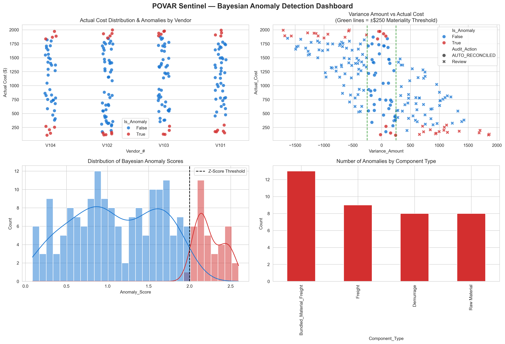

# POVAR Sentinel: Automated Purchase Order Variance Audit & Anomaly Detection



**POVAR Sentinel** is a hybrid audit automation system that streamlines the reconciliation of high-volume procurement transactions. It combines intelligent rule-based financial controls with probabilistic Bayesian modeling to detect pricing anomalies, auto-reconcile low-risk items, and identify operational bottlenecks.

By significantly reducing manual review workload while preserving audit integrity, POVAR demonstrates a practical, real-world application of data science in financial controls and procurement operations.

## Key Features

- **Dual Materiality Triage**: Automatically reconciles low-risk transactions using **both absolute (±$250) and relative (5%) variance thresholds** — mirroring real-world audit practices to effectively filter noise while prioritizing high-impact items.
- **Hierarchical Bayesian Anomaly Detection**: Built with PyMC to learn vendor-specific pricing behaviors and flag statistically significant outliers (Z-score > 2.0).
- **Billing Silence Monitoring**: Detects stalled or missing invoices with configurable operational thresholds.
- **Data Quality Gate**: Enforces strict schema validation and comprehensive audit logging.
- **Actionable Insights**: Generates prioritized reports with severity scoring and rich analytical visualizations.

## Tech Stack

- **Bayesian Modeling**: PyMC, ArviZ
- **Data Pipeline**: Pandas, NumPy
- **Visualization**: Seaborn, Matplotlib, Plotly
- **Other**: Python, logging, synthetic data generation

## Project Highlights

- Developed a **hierarchical Bayesian model** that adapts to individual vendor pricing variability.
- Implemented **dual-threshold materiality logic** (absolute + percentage) for intelligent automated reconciliation.
- Designed an end-to-end production-style pipeline with triage, modeling, and reporting.
- Created a multi-panel analytical dashboard that visualizes statistical anomalies alongside business materiality rules.
- Built a flexible synthetic data generator for robust testing and demonstration.

## Dashboard Preview

The visualization below showcases:
- Cost distributions and detected anomalies by vendor
- Variance analysis with **dual materiality thresholds** (±$250 and 5%)
- Anomaly score distribution and severity
- Breakdown by component type


## Project Structure

```text
POVAR/
├── data/                    # Datasets and generated visualizations
├── src/                     # Core pipeline, Bayesian model, and reporting
├── tests/                   # Synthetic data generator and validation
├── requirements.txt
└── README.md

## Quick Start

```bash
# Clone repository
git clone <your-repo-url>
cd POVAR

# Setup environment
python -m venv .venv
source .venv/bin/activate        # On Windows: .venv\Scripts\activate

pip install -r requirements.txt

# Generate test data
python -m tests.generate_test_data --generate

# Run full analysis
python -m src.model